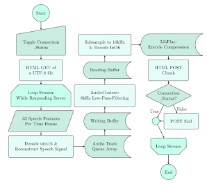

# Streaming of the Speech Features

The JavaScript client is in stream_client/index.html. It is a web user interface that captures, downsamples to 16kHz, and POSTs speech chunks to Python. Simultaneously, the interface also streams, upsamples, and reconstructs back the speech signal. The SQT features in the 16kHz are 32 harmonic energies along with the vividest fundamental frequency in the range 55-880Hz. See the following figure for the flowchart, which does not exactly describe the implementation. The LibFlac, a JavaScript library, is being used to compress the audio chunks in streaming mode. The Flac is lossless and reduces about 30% from the PCM chunk size. Another library also used is AudioContext, for the browsers' compatibilities, which also include mobile versions. This implementation simplifies the compatibility of the devices in future work. 

Figure: Flowchart of the User Interface. \

## [Live Demo](https://app.recite.live/t1) 
* Privacy Notice: your voice may be recorded when you test the demo URL. 
* On the demo page, click "Connect," and it would prompt to request your consent before connecting to the microphone and speakers. It has been tested on Chrome, Firefox, and Safari. The Safari also requires the user to manually enable JavaScript from its settings. The server function is currently set to output the features given Flac input. The SQT features are the fundamental frequency and the harmonic energies. The total delay aggregates the ping, the server processing, and the audio readings and writings times. 

## Configuration Notes

* Copy the files to a host and check the files' permissions. 
* Modify the URLs in the index.html file to map to the new directories. 
* Edit the "./\*" HTTP requests to point to a custom server or to the echo demo "https://app.recite.live/t1/*".
* Also modify the "libflac.min.js.mem" URL in the  libflac.min.js file. 

## Libraries & Acknowledgments

### [LibFlac.js](https://github.com/mmig/libflac.js)
* libflac.min.js
* libflac.min.js.mem

### [jQuery](https://jquery.com/)
* jquery-3.5.1.min.js

### Google voice [icons](https://icon-library.com) 
* mic_off.png
* mic_on.png

